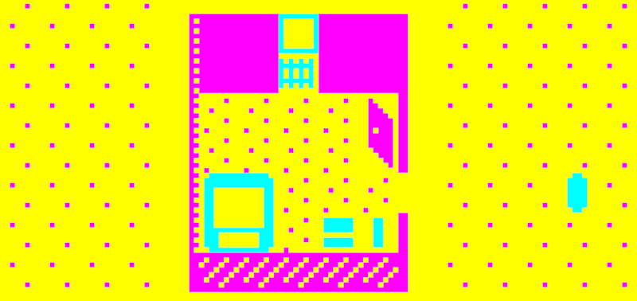

# *b r 1*

# [Play Online](https://www.pippinbarr.com/b-r-1/) (desktop and mobile)

## Description
*A room! A trunk! A tube! A bed! A radiator! A light! A landscape! A darkness! A separation! A floating in air! A doubling! An intersection! And more! And more!*

_b r 1_ (Bitsy Reality 1) is a [Bitsy](https://ledoux.itch.io/bitsy)-based remake of my earlier [Unity](http://unity3d.com)-based game [_v r 1_](http://www.pippinbarr.com/2016/05/19/v-r-1/) which was itself an attempt to "remake" Gregor Schneider's _u r 1_ from his [The Haus u r](https://en.wikipedia.org/wiki/Gregor_Schneider#The_%22Haus_u_r%22) project.

## Press
- Pierre Corbonais. [v r 1/b r 1](http://oujevipo.fr/general/6874-v-r-1b-r-1/). Oujevipo. 29 May 2018. (An incredible Twine-based interactive 'review'.)

Read the [Press Kit](../press) for press information

## Documentation
* Read the [Closing Statement](../process/closing-statement.md), a short essay about the project
* Read the [Process Documentation](../process) for process journal entries, blog posts, to dos, and manifestos
* Read the [Commit History](https://github.com/pippinbarr/b-r-1/commits/master) for detailed, moment-to-moment insights into the development process
* Look at the [Code Repository](https://github.com/pippinbarr/b-r-1) for source code etc.

## License
_b r 1_ is an open source game licensed under a [Creative Commons Attribution-NonCommercial 3.0 Unported License](http://creativecommons.org/licenses/by-nc/3.0/). You can obtain the source code from its [code repository](https://github.com/pippinbarr/b-r-1) on GitHub.
