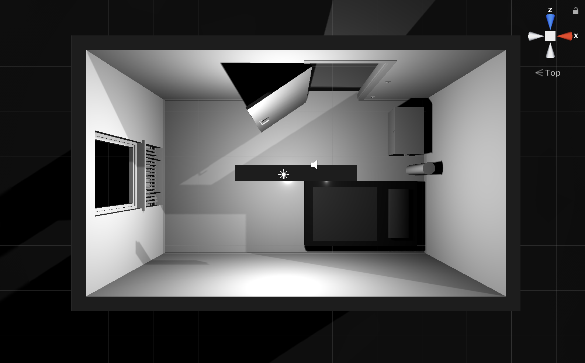
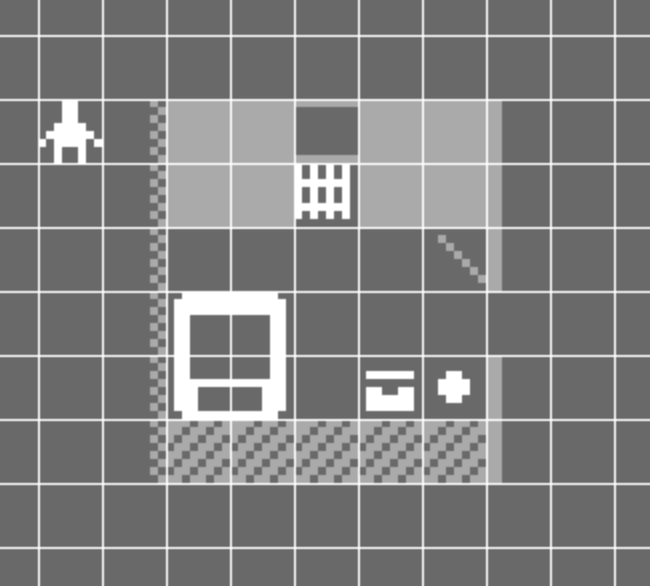

# Saturday, 5 May 2018, 16:09

Just started up this project after thinking of it, I think, last night? Very recently anyway. The premise of the game is to demake the first three _v r_ games in Bitsy as a way to play around with it as a tool and have an actual objective. I'm also just interested in this because all three of those games were really focused on the engine (Unity) and so to remake them in a new (incredibly limited) engine feels like a fun challenge that might help me learn something and raise some ideas about the original games back up to the surface.

My initial foray was just to make a title screen for the collection, which I managed okay. Found out you can have multiple palettes which makes life easier by a lot. So the title screen is just wall tiles in the shape of letters to spell out _v r 4_ and the "title" of the game is, for now, "Pippin Barr presents..." so that that comes up in the initial dialog and then the title of the game.

Next things:
- transition from the main title to the next thing.
- the question of whether there should be a menu system or just the sequence of the games (I think the latter since there's no particular reason why any of these will be all that long? Or... should there be?
- should this actually be called 'b r' (for "Bitsy Reality"?) and thus b r 1, b r 2, b r 3? That would be kind of funny. But then I also like the idea that this, too, is a _v_irtual reality and so constitutes _v r 4_? But perhaps a menu system is going to be appropriate...

An immediate problem:
- you can't hide things inside walls in this engine, which will make v r 2 really difficult to remake. Have to give some more thought to what it means for something to be inside something else and not visible/experienceable. The first option in my head right now would be that you could draw a wall tile that has the "real object" inside it, but then you would fill in the rest of the tile so it becomes a white square. So the drawing is sort of "in there" in the sense that it was drawn at one time (maybe I could even do that final filling process right at the end? Interestingly version control would then be available to uphold my claim the things are "really in there"? That's intriguing.)

---

# Sunday, 6 May 2018, 12:55

Performed the important task of actually making an initial sketch of the room from v r 1. It was (perhaps predictably) unsatisfying. It doesn't look remotely like the game (or the original).

I wrote about this in my commit message, but a key aspect of the project that became apparent is the question of whether I'm trying to recreate the games as they were when finished, or whether I'm trying to follow the same principles of developing those games, but in a new engine. It makes most sense to me that I'm doing the latter - making v r 1 again, but with the constraints and nature of Bitsy as a new set of formal constraints, distinct from those of Unity.

Bitsy makes some stuff really hard. If I want to make versions of the games that actually evoke the spirit of the original games, it's going to be a challenge. There's a huge amount loaded onto the visual possibility of low resolution sprites/tiles. The obvious temptation (perhaps necessity) is to make highly specialised sprites in order to get a little bit of detail and expressivity out of it all. Given that the grid is relatively small, and given that you only have one colour to paint any given sprite/tile in, you need to leverage the fact of the (still small) resolution of the tile/sprite itself to get some subtlety. I've seen other Bitsy games doing this so impressively, and the amount of work involved hadn't really registered until just now.

At the same time, I don't want to get too deep into the 'beauty' of these things, since that's not really the idea? The idea is still pretty utilitarian, but I need to evoke the original settings (u r 1, Marfa) and contexts (the bed, radiator, plinths, water, etc.). So it turns into a tile-based drawing challenge perhaps more than anything else, at least at the base level of evoking the scene. And _then_ the philosophical elements around the interactions, the reconfigurations, the representational possibilities (of water, of hiding) and so on come in.

So next task will be to draw myself a better version of v r 1. I'm starting to seriously think I should demake them individually, though, and then just create a menu for the package itself which constitutes v r 4. I think it could be hellish trying to manage three separate games in one? Biggish decision though? Or not? Unsure.

---

# Thursday, 10 May 2018, 12:06

Just wanting to list the configurations in the original v r 1 so I can think about them:

- Start (outside default room)
- Door down
- Door in floor (as in you fall down into the room)
- Door to door (gives us a spatial requirement)
- Floating objects (sounds impossible?)
- Floating room (oh boy)
- Hole in floor (hmmm)
- Intersection
- Lean (one leaning on another)
- Locked out
- No light
- Organised
- Pieces (in disorder)
- Sunken (into the ground, but oriented normally)
- Upside down (huh...)
- Window to window
- End (inside default room with the door closed and 'locked')

Also here is a picture of the default configuration of the room:

12:12

A small addendum to this. There are 17 rooms including start and end in the game, numbered 1-17 and then displayed in random order except Start and End. The order of rooms in the Unity UI is like this:

- Intersection
- Door down
- Door in floor
- Door to door
- Floating objects
- Floating room
- Hole in floor
- Lean
- Locked out
- No light
- Organised
- Pieces
- Sunken
- Upside down
- Window to window

And then we have Start and End on either side. But it probably doesn't matter since the middle 15 are randomised at run time I believe?

---

# Thursday, 10 May 2018, 13:57

Having spent a little time trying to construct the initial v r 1 room in Bitsy I thought I'd write some notes about the thoughts and questions that has triggered. Here's what I came up with in that session alongside the Unity version:

So first of all there are _questions of legibility_ at the outset, notably if we imagine someone playing this game who has no familiarity with either v r 1 or u r 1:

- Does the radiator look like it's meant to be a radiator?
- Does the bed look like a bed or a big weird tv?
- etc. Does anything look like the thing it's meant to evoke? And given that the original room (u r 1) is kind of _about_ the evocation of some sort of space that a human might be in and what kind of person and so on?

There are also something like _question of spatiality_?

- The door is currently bird's eye but ought to be in this kind of fake tilted perspective.
- Right now the window wall is a full tile higher than the opposite wall. Could this be forgiven as a trick of perspective? It's like this out of a kind of necessity: the window wall needs to fit both a window and the radiator below the window - that's non-negotiable and can't be done in a single tile I think. (Not to mention that the wall should be higher than the avatar!) The back wall is one tile out of nervousness about showing the bed, trunk, and tube... if I were obeying perspective they would be flush with the base of the wall and thus occluded - with a two-tile-high wall they would be completely invisible, which isn't okay.

And just to break out of that format, since I'm not sure it was helping, I think there's an overriding need (that overrides space and perspective) that you can definitely see all the items in the room. That means: window, radiator, bed, trunk, tube. That strikes me as non-negotiable.

I kind of like how this does somewhat relate to the underlying Schneider reference? His work is about spatiality and the seen and unseen and spatial composition. It's funny to grapple with it in this highly constraint way. It's in some ways a way of reaching for some of the ideas around the difficulties of craft that he works with? He struggles with imperfect materials to make things identical, perfect, I'm struggling with a perfect materials to make things legible, humanised, real.

I see a need to make the room one tile taller (at least) to allow for the door to have an extra tile for 3Dness, and to better represent the space between the bed and the window wall.

But that brings me to the other question, which is the _default room relative to reconfigurations/transformations_. It's one thing to successfully make a version of the default room, it's another to be able to then transform that room in the 'same' ways as the original game did. That's a whole other kettle of fish I'll write about separately, but for now just let me note that there are fundamentals like: can you fit two the rooms end to end on the screen in the first place? That's a hard limit, since it makes no sense to me to spread any given scene across two rooms. I mean, maybe if I have to, but I prefer the totality being on one screen.

So there's complexity going on here, quite a lot of it.

---

# Friday, 18 May 2018, 14:11

Several days later because I went off to Yellowknife to teach a workshop about creating worlds with Unity and its terrain generator etc.

## Unique sprites

A think I want to note explicitly here is that _Bitsy only allows one instance of any single sprite in the entire game_ (in this way it's like the avatar too - the avatar only exists in one room in the editor, making that the starting room of course). That complicates matters for me because it means that when I make certain elements in the game sprites (notably for now the bed, radiator, trunk, and tube) they're only usable in one room. If I want to have a radiator in another room (which obviously I have to) I have to make a new radiator for that room. If I want two radiators in the same room (e.g. when there is a duplication effect) I need to create two radiators for that specific room.

This is blatantly super annoying at a technical level. A solution would be to render all the objects as tiles instead so that they're immediately repeatable, but that has a couple of flaws. One is purely aesthetic: I'd be throwing away one of my colours in a game that already only has three colours available (background, tile, sprite/avatar). The other reason is more ontological/conceptual - the radiator, trunk, tube, bed fit better as sprites than they do as tiles - they're "items in the world" rather than structural properties or decorative properties, which seems to be the function of tiles. They're not walls, they're objects, and thus sprites make the most sense for them (this way they can also have descriptive dialog, for example, if wanted, though that brings its own conflicts).

Also on a conceptual level, this seems to fit very nicely with the objectives of v r 1. I mentioned this in the commit where I discovered this ([984beb9](https://github.com/pippinbarr/v-r-4/commit/984beb95121b726e3e70b419252fb8cdb518996a)), but it feels like there's a relationship here between Bitsy and Gregor Schneider's process. A better fit than what I did in the original v r 1 using Unity. Specifically, if Schneider is all about duplication through painstaking effort - through actually doing the work to create the duplicate and put it in place, then this Bitsy experience is more accurate. There really are two radiators, for example, not just a prefab used twice, not just a cut and paste. It's two objects under the hood, and that strikes me as appropriate.

## Game jam?

So now that I'm back from Yellowknife and before I go to Naples, I have it in mind to finish this game. That would be a pretty intense burst of work that would take over the weekend etc., but I think it would be nice to finish something - it's been a while, and this feels like a project that's perhaps within reach?

My only caution, I guess, is that some of the ideas underlying this process are turning out to be kind of complex. I still haven't resolved the water situation for v r 3 for example - tricky. Tricky. Hmm. Nor, really, the contents of the plinths in v r 2. So there's a lot of thinky work needed, and it's not clear that would be improved by moving fast?

Not to mention the question of documentation with MDMA in a speed-oriented way? Maybe it'll all be fine.

I should probably just try and see.

## So then

Off I go I think. Work work. At the very least I think I have a clear path for working on v r 1. So that's what I'll do for right now.

---

# Saturday, 19 May 2018, 12:15

Back to work on this warm, cloudy Saturday. Yesterday I did manage to dive into making a few of the v r 1 rooms. I made: door-to-door (finished it), hole in floor (partially), locked out, organised, window-to-window. Each of them introduced thoughts, constraints, weirdnesses, etc. This is the point of doing this kind of project of course.

Things that are on my mind include...

_The relationship between v r 1 the actual game, v r 1 the conceptual process, u r 1 the original work, v r 1 the Bitsy remake_. Specifically, it's pretty obvious that there's no real way for me to 'just' literally recreate the different v r 1 scenarios in Bitsy because some of them rely very specifically on affordances of Unity that don't exist in Unity. Something like the version in which the rooms lean on each other, for instance, or where the room floats in the sky. Those are 3D specific ideas that rely on perceiving a true 3D space (I think?). So how do I approach that with Bitsy? I seem to have a couple of possibilities. One is that I try to visually recreate the v r 1 scenarios, even when they're not really functional in the same way - create the appearance of the floating room by just representing the light from its doorway, say. I'm not sure that's satisfying because it doesn't really engage with the ideas behind v r 1, which were to think about Schneider-esque work in the context of a game engine, how to create repetition and variation, to work with the materials at hand etc. Part of the problem, even, might be that I don't or didn't really have a firm grip on what v r 1 was truly about? It shares more, perhaps, with my variations games than with Schneider? At any rate, the second option, in response to this, is to try to create the version of v r 1 I _would have made_ in Bitsy - that would mean creating Bitsy-oriented versions of the original room. This is already kind of weird because I'm clearly looking to recreate the _Unity_ versions of scenarios by having, for instance, this 2D/3D appearance that evokes my Unity version of the room rather than Schneider's version... really painted myself into a weird corner here?

That's really the biggest conceptual 'moment' going on here. It'll end up applying to all the other games (v r 2, v r 3) too, because in each case you have to ask if you're remaking the game or the idea. The 'idea' seems far more interesting, frankly. Consider something like v r 3 where, rather than try to redraw complex different kinds of waters from the original game, you seek out waters from existing Bitsy games and put those in instead? (Does Bitsy have a default water though? That I can parameterise? Not really. And then I'll run into palette stuff too... fuck...)

_Are the dialogs any good?_ I popped some dialogs into the start room that describe things when you walk into them. It's kind of satisfying and gives a little more worldiness to the space. However there's an instance in which this interacts with my idea you could look through the window by having it not be a wall (so you can occupy its space): you can 'look at' the radiator from the window, which is literally impossible in the actual space because the radiator is recessed below the window. That bothers me enough that I suspect it's better to not make the window 'visitable', just make it a wall and live with it. There are these constant interactions between visuals and physics, specially the fact this is true 2D and not isometric or similar, despite the fact I'm drawing it as isometric to evoke some of the Unity perspective. Trade-offs.

_Time?_ There's the notion of time in the original game. Both in terms of a timer that switches rooms after a set period no matter what, and a timer that switches rooms more quickly if you stand in a trigger area. Those two ideas don't seem reproducible in raw Bitsy - any room switching is instant. You could delay by creating a sequence of multiple rooms than have to be quickly passed through I suppose, but hmm. The falling through the floor is the big one because it relied on a timer to pull you to the next level, but allowed you to experience the time of falling. (This stuff is only really a thing for v r 1, the other two don't really involve time at all.)

Those are the big three for now I suppose? Along with technical difficulties that are continuous and inevitable.

Just thought that perhaps a Bitsy specific formal version could be to reconstruct the room space in a different order - randomised within the same space it traditionally occupies? Palette is another thing that can be done. Animation is yet another that could be interesting (every piece could be in flux between all possible representations?). It seems like it should be possible to replace some of the impossible rooms with Bitsy-rooms anyway.

And now, back to work for a bit to make any more 'easy' rooms I can make.

---

# Saturday, 19 May 2018, 14:44

Another burst on the game has seen me produce a few more rooms and run into a couple more things worth extracting from the commits I think. (Though this is making me think about MDMA and the kind of give and take involved in differentiating commit messages from journal entries. What is the difference? What are the accessibility implications? What are the use-cases?)

Aaaaanyway. Key things noticed:

- _Physics_. In the versions of the room that involve rotation (door down, door in floor) I intuitively made the decision that the Bitsy version would recreate the _outcome_ of the physics in Unity. In the editor in Unity the bed, tube, and trunk are all just stuck to the 'wall' in those two scenes, all perfection. But when the game runs they have Rigidbodies and fall down, so by the time the player sees them they're in some kind of mess on the new 'floor'. In Bitsy I drew new sprites that represented the items on the floor or leaning on the wall. A big reason for that, actually, was that I did initially do the version where they stick to the wall (because I'd been studying the editor view in Unity), but it was very unclear as an image. I could have clarified with dialog, but it was a bit ugly - so I'm happier visually with what we have now. I guess an interesting thing here is that there's a clear desire to evoke the aesthetic of the _game_, which was kind of trying to evoke a mood from the original (in a videogame way). So there's an aesthetic through-line, not just a pure conceptual one. In "emulating" the physics I'm just drawing things so they look like they fell, though because I spent so much time with the original I know, for instance, that the bed often just leans on the wall.

- _Palette_. It's neat to recognise I can use the palette to create the 'dark' room where the light is off. Simple and effective.

- _Dialog_. As above to some extent, but it's becoming more and more clear that the texts are useful and interesting. There was certainly a point where I imagined just not including them at all, but they're necessary and can give definite flavour and clarity to the work. I think a very flat descriptive tone will make sense here and will go with the simple aesthetics. It's also nice in that it leverages a key core feature of Bitsy to take some of the pressure off the rest to represent Unity-esque things.

- _Concept / appearance_. As I go I'm starting to accept the game will probably be a _mix_ of things that seek to recreate the look/feeling of the Unity version (e.g. simulating physics above), and things that recapture the conceptual nature of the Unity version (e.g. in the bit where the room has fallen into pieces rather than having them overlapping etc. in Bitsy it's more natural/accurate to just intermingle tiles all within the same room space. It looks good too.) I'm kind of happy with this, and I think it reveals a key decision/pressure point.

---

# Saturday, 19 May 2018, 16:58

Third journal entry for the day, in keeping with the jam-i-ness of this push. A couple of important things have come up since the last post.

_Bitsy-specifics_. There's a marked difference between working with Bitsy as Bitsy and working with it as an awkward way to reproduce Unity scenes. The scenes in which I focused more on a Bitsy-centric approach were really satisfying and "right" to do in a way the rest haven't been. So palette-swap was very nice both for the dark room and for the straight up emphasising palette room (using CMY and not K). Both the organised and "pieces" scenes were nice in emphasising the specifically tile-based nature of Bitsy and this rendering of the game. Actually this is true of the "items" version too where you can pick up the objects in the room (notably when you pick up a quarter of the bed at a time). Also just put together the animated version, which involves flashing tiles on and off to create a pretty different visual effect, a kind of quantum flux that's appealing.

_Scale_. On the way back from coffee earlier it occurred to me that this project is a pretty ok size all on its own already and that it might make more sense to just release this on its own and then to v r 2 and v r 3 separately. I like that not least because it means I could actually finish the entire thing by the end of the weekend I believe. But also I think it's respectful of the project, which has involved a good amount of thought and grappling with ideas. I think it also makes sense as a way of having a MDMA exemplar that's not too enormous and scattered over time. If I polish this off and do things like write the "capstone" essay at the end, it'll be a nice vision of how the method can work. (This requires me to write another manifesto now I think.)

_Naming_. Following on from the above, it makes sense to rename the project in this case. Importantly, I feel this lets me go back to my idea of naming this game _b r 1_ (Bitsy Reality 1), which is fun and feels like it works well with the overall concept.

---

# Sunday, 20 May 2018, 14:41

Made a good bit of headway in the last session. The main task was placing exits. I think I covered the details and decisions pretty well in the commit message to be honest, but I felt like I ought to write a journal entry just to stay productive?

## MDMA

I'm definitely thinking about how this project relates to MDMA specifically - I feel like it's possibly quite a good scale to point people to if they're wanting to look at a total piece of work that uses that method. The journal has 4200 words right now, the commits are around the same (and there are 20 commits just now), the scale of the game itself is moderate, it changed directions pretty strongly (when I went from v r 4 to b r 1), there are a couple of manifestos (I should write another), the todos are pretty much on point, etc. Even at this scale it's a lot of reading, a lot of material, but it seems manageable in a way some of my other stuff hasn't been?

## What now?

I still have to add dialog throughout the game, that's the really big final activity in terms of it being completed. That's 'just writing' though and is made significantly easier by the fact that I'll just be option-clicking on objects and writing descriptive text. Generally speaking the text can be flat and repetitive (the tube remains a tube), but then there are opportunities to communicate more specific ideas, like darkness or views through windows. So I think that will be fun and will kind of complete the game. Seems like a single push could get me all the way to a finished game.

Then I obviously have to write the press kit and contemplate whether this is even worth sending to press in the first place?

## Capstone?

Jonathan has talked about the idea of "capstone" essays that give people access to a project's ideas without overwhelming them. It certainly occurs to me that that's something I want to do for this project. Or perhaps this is a partial stage of it? It seems like there's room for a fairly pithy piece of writing (500 words? 1000 words?) that lay out the key ideas in the piece, nail down its history of development, and reflect on how it went. (That sounds a fair bit like a presskit, maybe they'll be interchangeable.) It seems a good challenge to write that document and then perhaps put it right at the front of the repository in the README? I guess it could realistically be a version of an artist's statement? It kind of makes me think of those things you find in books that have guidelines for thinking about the text more closely?

## Wiki?

I don't honestly know how happy I am with the journal/todos being separate from the main repository? I thought the wiki approach would be awesome, but is it? Maybe it is. It misses out on that idea that if you check out the version associated with the entry you have the version that was the context when it was written? That's a strong bond that's a shame to lose... you can still do it by checking the date/time and finding the related commit I guess, perhaps that's sufficient.

---

# Sunday, 20 May 2018, 18:07

Second entry of the day. The game is essentially finished now I think? I wrote the dialog for all the rooms and fixed a few bits and pieces like 'organised' having an incorrect number of tiles and so forth, nothing deeply interesting about it?

Well the dialog writing was interesting because it's kind of the 'other half' of Bitsy's system of representation, I suppose it's partially what 'makes up for' the low resolution - the high resolution of words. It's a relief to be able to describe things twice so that things aren't lost through the sheer abstraction of the 8x8 pixel images. Drawing a bed leaning against a wall is not straightforward, for instance, and it's good to know that if the player approaches it (at least in one case) they will get a description of what it is.

Made a trailer for the game and took some screenshots. The trailer is just the first room and then a freeze-frame of the second, no need to go overboard. Just slowly putting together the press materials for the thing now, with the idea that by the end of today it will be fully releasable and I could send it out to press (not that anyone will cover this).

In the end I think this is quite probably a game that will interest only me. It's been a great test-drive of Bitsy, it's been a really interesting engine-translation project from my perspective, and I think it's a good model use of my current understanding of MDMA as it stands. So I think it has ticked a lot of personal boxes. Being universally loved and admired is likely not something it has to look forward to, but it serves its purpose.

Reflecting briefly on design/development, it's been interesting to me how it started slow with quite a lot of false-starts and thinking around the engine and how I would use it, but then really the vast majority of the project has been done in the last three days. You still need that conceptual work up front (for a conceptual project at least?) but it's good to know that when things are more or less 'settled' it's possible to motor through. Unsure whether the quality of thought is diminished by moving this fast, but hopefully not.

---

# Sunday, 20 May 2018, 20:05

Okay, well I think the game is done as much as it'll get done at this point. Remaining points to think about are sending it to press people (I guess I will since it's just sort of the right thing to do and a way to keep my eye in) and writing this idea of a 'capstone' or kind of description/summary essay that can be read by people who want to get a more detailed fix on the project without reading thousands of words of process documentation. I guess to write that I just need to read the commits and this process journal and whittle it into a shape that's accessible for people, probably with links to specific journal entries, commits, maybe screenshots, etc.? I like the idea, just have to convince myself to actually do it. Not that it's needed desperately for release, but it's likely something I should write sooner rather than later so that it's fresh in my mind - seems like it should/can be a 'hot take'.

In the end this project went really well. _b r 2_ and _b r 3_ lie in my future with their own fairly interesting issues and challenges that I'll gladly accept. I guess I need to think about whether I just start _b r 2_ right away or whether I return to the Love game now? Hard to say. That's thinking for another time. Bye for now.
